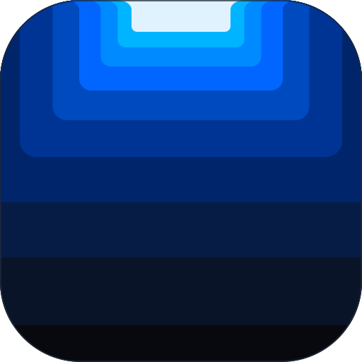

# Çentik (Centik) 🏔️

> **"Çentiğindeki ada."** — *Your notch, working.*  
> MacBook çentiğini masaüstünüzün en hızlı, pil dostu ve kullanışlı eylem merkezine dönüştürün.

  

---

## 🎯 Çentik Nedir?

Apple, MacBook ekranlarına çentiği yerleştirdi ancak bu alan yıllarca siyah bir boşluk olarak kaldı. Mevcut üçüncü parti çözümler ise ya yüzlerce gereksiz özellikle bilgisayarı yavaşlatmakta ya da pil ömrünü ciddi şekilde tüketmektedir.

**Çentik**, sadece bilgi gösteren bir "süs adası" değil; günlük iş akışınızı hızlandıran **"bitiren ada"**dır:
* 📁 **Bırak, Dursun:** Dosyaları çentiğe sürükleyin, pencereler arasında kaybolmadan istediğiniz yere taşıyın veya AirDrop ile paylaşın.
* 📋 **Kopyala, Bul:** Son 30 kopyalamanızı anında arayın ve tek tıkla yapıştırın.
* 🎵 **Bakmadan Bil:** Apple Music ve Spotify parçalarını kontrol edin, ses seviyesini ekranı kapatmadan ayarlayın.
* 📅 **Toplantıya Bağlan:** Takviminizdeki sıradaki Zoom/Meet görüşmesine tek tıkla katılın.

---

## ⚡ Neden Çentik?

1. **Sıfır Pil Kaybı (%0 Idle CPU):** Arka planda asla sonsuz döngüler (`Timer`) çalışmaz. Yalnızca sistem olayları (`DistributedNotification`, `NSPasteboard.changeCount`, `FSEvents`) ile uyanır.
2. **Çentiksiz Mac'lerde Kusursuz Hap (Floating Pill):** Harici monitör veya çentiksiz MacBook modellerinde ekranın üstünde zarifçe süzülen yüzen hap moduna geçer.
3. **Gizlilik ve Yerellik (Local-First):** Hesap açma yok, bulut senkronizasyonu yok, telemetri yok. Verileriniz yalnızca cihazınızda kalır.
4. **Açık Çekirdek (Open Core):** Çekirdek altyapısı MIT lisansı ile tamamen açıktır ve denetlenebilir.

---

## 📦 v1 MVP Özellik Kapsamı

* [x] **Ada İskeleti & Hap Modu:** Çentiği kusursuz saran, hover (0.2s) ve `⌥Space` ile açılan, `Esc` ile anında kapanan sıvı animasyonlu cam panel.
* [x] **Dosya Rafı (FileShelf):** Sürükle-bırak dosya tutma alanı, kopyalama/taşıma desteği, tek tıkla AirDrop.
* [x] **Now Playing & Medya:** Apple Music & Spotify entegrasyonu, albüm kapağı, oynat/duraklat ve 15sn atlama.
* [x] **Sistem HUD:** Ses, ekran ve klavye parlaklığı seviyelerinin çentik içinde modern gösterimi.
* [x] **Mini Pano (Clipboard 30):** Son 30 pano kaydı, anlık filtreleme ve yapıştırma (şifreler otomatik filtrelenir).
* [x] **Takvim / Toplantı Çipi:** Sıradaki görüşme rozeti ve doğrudan toplantı linkine yönlendirme.

---

## 📚 Dokümantasyon

Projenin tüm detaylı mimari, strateji ve tasarım belgeleri `docs/` klasöründe yer almaktadır:

* 📄 [01 – Vizyon ve Strateji](docs/01-vizyon-ve-strateji.md): Ürün vizyonu, iş modeli, açık çekirdek ve $19 Pro planı.
* 📄 [02 – Ürün ve Özellik Spesifikasyonu](docs/02-urun-ve-ozellik-spesifikasyonu.md): v1 MVP modül detayları, kullanıcı etkileşim kuralları ve v2 yol haritası.
* 📄 [03 – Teknik Mimari](docs/03-teknik-mimari.md): Swift 6, `NSPanel` konfigürasyonu, Event-Driven pilsiz yapı ve kod dizini.
* 📄 [04 – Marka ve Tasarım Rehberi](docs/04-marka-ve-tasarim-rehberi.md): Renk paleti, `centik-logo.svg`, tipografi ve landing page metinleri.
* 📄 [05 – Rakip Analizi ve Pazar Stratejisi](docs/05-rakip-analizi-ve-konumlandirma.md): Notchy, NotchNook, Boring Notch kıyaslaması ve pazar boşluğu.
* 📄 [06 – Tasarım Dili ve Arayüz Sistemi](docs/06-tasarim-dili-ve-arayuz-sistemi.md): Malzeme hiyerarşisi, yay animasyonu fiziği, bileşen anatomisi ve 8pt ızgara sistemi.

---

## 🛠️ Geliştirme Gereksinimleri

* **macOS:** 14.0+ (Sonoma, Sequoia veya macOS 26 Tahoe)
* **Xcode / Swift:** Swift 6.0+ (Strict Concurrency)
* **Mimari:** Apple Silicon (M1/M2/M3/M4/M5) & Intel desteği

---

## 📄 Lisans

Çentik çekirdeği [MIT Lisansı](LICENSE) kapsamında açık kaynak olarak sunulmaktadır.
